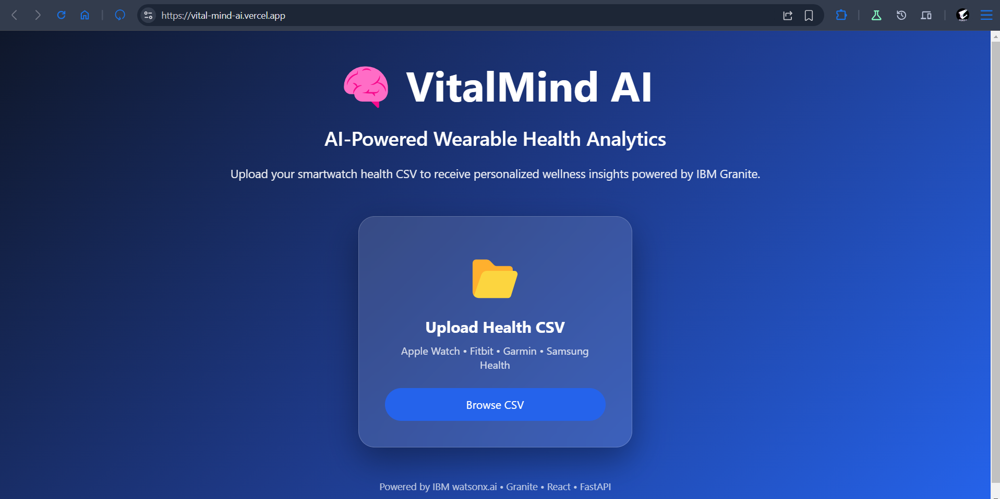
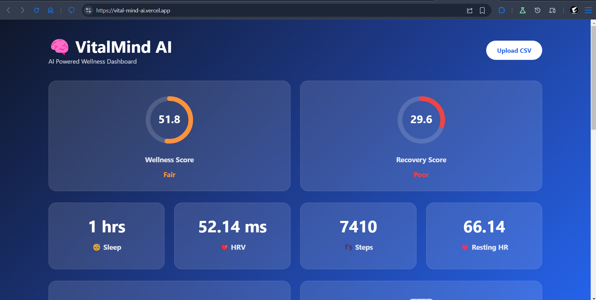
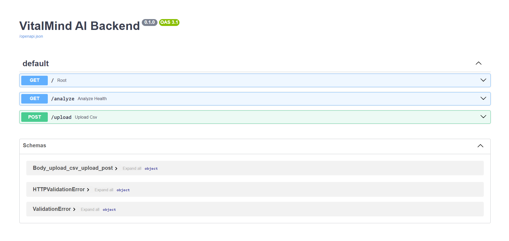

# 🧠 VitalMind AI


> AI-powered wearable health analytics using **IBM Granite** on **IBM watsonx.ai**.

---

## 📖 Overview

VitalMind AI is an AI-powered wellness assistant that analyzes wearable health data and generates personalized wellness insights.

The application allows users to upload smartwatch health data in CSV format, calculates important wellness metrics such as Recovery Score and Wellness Score, and leverages IBM Granite on IBM watsonx.ai to provide personalized lifestyle recommendations.

The project focuses on preventive wellness and healthy lifestyle improvements rather than medical diagnosis.

---

## ✨ Features

- 📂 Upload smartwatch health data (CSV)
- 🤖 AI-powered wellness recommendations
- ❤️ Recovery Score calculation
- 🌱 Wellness Score calculation
- 😴 Sleep analysis
- 💓 Resting Heart Rate analysis
- 📈 Trend detection
- 📊 Interactive dashboard
- ⚡ FastAPI backend
- ⚛️ React frontend

---

## 🏗 System Architecture

```text
Wearable CSV
      │
      ▼
 FastAPI Backend
      │
      ▼
Health Analyzer
      │
      ▼
IBM Granite (watsonx.ai)
      │
      ▼
Personalized AI Insights
      │
      ▼
 React Dashboard
```

---

## 🛠 Tech Stack

### Frontend

- React
- Vite
- Axios
- CSS

### Backend

- FastAPI
- Python
- Pandas
- NumPy

### AI

- IBM watsonx.ai
- IBM Granite 4

---

## 🚀 How It Works

1. Upload a smartwatch health CSV.
2. FastAPI processes the uploaded data.
3. Health metrics are calculated.
4. IBM Granite analyzes the health summary.
5. Personalized wellness recommendations are generated.
6. Results are displayed in the React dashboard.

---

## ☁ IBM Technologies Used

- IBM Cloud
- IBM watsonx.ai
- IBM Granite Foundation Model

---

## 🌍 Social Impact

VitalMind AI promotes preventive healthcare by helping users better understand their daily wellness patterns through wearable data.

The platform encourages healthier habits while avoiding medical diagnosis, making it suitable for general wellness monitoring.

---
---

## 📷 Application Preview

### 🏠 Home Page

Users can upload smartwatch health data in CSV format for AI-powered analysis.



---

### 📊 Wellness Dashboard

The dashboard displays wellness metrics, trend analysis, and personalized recommendations generated by IBM Granite.



---

### API Docs

backend api docs



---

## 🌐 Live Demo

### Frontend

https://vital-mind-ai.vercel.app

### Backend API

https://vitalmind-ai-z6g2.onrender.com/docs

## 📂 Sample Datasets

The following sample datasets are included for testing:

- 📄 [health_data.csv](sample_data/health_data.csv) – Standard sample wearable health data.
- 📄 [health_data-2.csv](sample_data/health_data-2.csv) – Example dataset with alternet data.


Simply upload this file on the web application to experience the complete AI-powered wellness analysis


---

## 📈 Future Scope

- Apple Health integration
- Fitbit integration
- Garmin integration
- Samsung Health integration
- Google Fit integration
- Real-time wearable synchronization
- Nutrition recommendations
- Mental wellness analytics
- Mobile application
- Doctor dashboard

---

## 👨‍💻 Author

**Suryendu Das**

IBM SkillsBuild Internship Project
---

## 📄 License

This project was developed as part of the **IBM SkillsBuild Internship Program** for educational purposes.
